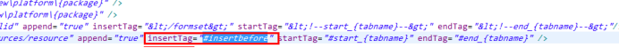
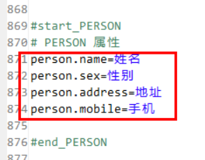

# 生成器介绍

- 1.支持多种数据库代码的生成。
   > 目前支持的数据库有 SQL2005，Oracle，mysql，DB2。
- 2.使用freemaker作为模版引擎，可以生成任意类型的模版。
- 3.支持用户自定义模版，添加到代码生成器中。
- 4.方便和eclipse，myeclipse等工具集成，使用ANT执行代码生成.
- 5.提供接口，允许用户自定义其他数据库的实现。
- 6.支持自定义全局变量和表级别变量。
- 7.在eclipse中支持代码自动提示。
- 8.支持增量式生成，可以将代码生成以增量的方式生成代码。
- 9.支持主从表代码生成，主表和从表都支持变量。可以支持一个主表多个从表的代码生成。
- 10.支持多个表一次性生成，可以支持生成数据库文档，支持word数据库文档的生成。

# 快速入门
- 安装ant
- 生成代码
```angular2svg
cd src/main/resources
ant //默认target为生成代码 
```
- 删除代码 
```angular2svg
ant deletecode
```

# 详细指南
#### 目录结绿
```
- refLib：		     目录为需要引用的jar包。
- template：		 是freemaker模版目录。
- codegen.properties 为代码生成时 所有到的数据库连接参数
- codegenconfig.xml  为代码生成的配置文件,包括需要的模版，生成的代码文件相关参数。
- build.xml：         为ant文件，执行代码生成。
```

#### 配置文件
1. 修改build.xm文件 
```angular2svg
<?xml version="1.0"?>
<project name="生成代码"  default="生成代码">
    <property name="lib.dir" value="./refLib"/>

    <path id="refLib">
        <fileset dir="${lib.dir}" includes="*.jar" />
    </path>

    <taskdef name="gencode" classname="com.hotent.cgm.main.Codegen">
        <classpath refid="refLib" />
    </taskdef>
    <taskdef name="deletecode" classname="com.hotent.cgm.main.CodeDelete">
        <classpath refid="refLib"/>
    </taskdef>
    
    <target   name="生成代码" description="生成代码">
        <gencode rootpath="..." xmlpath="..."/>
    </target>
    <target id="deletecode"  name="deletecode" description="删除生成的代码">
        <deletecode  root="..." xmlpath="./codegenconfig.xml" />
    </target>   
    
</project>
```
- <gencode />和<deletecode />

完整的写法是
```<gencode rootpath="..." xmlpath="..."/>和<deletecode  root="..." xmlpath="./codegenconfig.xml" />```
但默认为build.xml同一目录下的codegenconfig.xml文件,可不写。前者生成代码，后者删除生成的代码包


# codegenconfig.xml 
#### 模板配置
模版可以配置ID属性和path属性，可以包含多个模板。位于resources/template下。
选择哪个模板通过```codegenconfig.xml``配置
```angular2svg
	<templates>
		<template id="entity" path="x7\entity.ftl"/>
		<template id="dao" path="x7\dao.ftl"/>
		<template id="manager"  path="x7\manager.ftl"/>
		<template id="managerImpl"  path="x7\managerImpl.ftl"/>
		<template id="mapping"  path="x7\mapping.ftl"/>
		<template id="controllerNG"  path="x7\controllerNg.ftl"/>		
		<template id="managerVue"  path="x7\entityManagerVue.ftl"/>
	</templates>
```
#### 代码输出位置
```angular2svg
	<files baseDir="D:\workspace\sjs_managevue\shenjiaosuo_managevue\web\manage" >
    <!--后台代码 
    <file refTemplate="entity" filename="{class}.java" dir="src\main\java\com\{companyEn}\{system}\model"  sub="true" override="true"/>
    <file refTemplate="dao" filename="{class}Dao.java" dir="src\main\java\com\{companyEn}\{system}\persistence\dao" sub="true"  override="true"/>
    <file refTemplate="mapping" filename="{class}Mapper.xml" dir="src\main\resources\mapper"  sub="true"  override="true"/>
    <file refTemplate="manager" filename="{class}Manager.java" dir="src\main\java\com\{companyEn}\{system}\persistence\manager" sub="false"  override="true"/>
    <file refTemplate="managerImpl" filename="{class}ManagerImpl.java" dir="src\main\java\com\{companyEn}\{system}\persistence\manager\impl" sub="false"  override="true"/>
    <file refTemplate="controllerNG" filename="{class}Controller.java" dir="\src\main\java\com\{companyEn}\{system}\controller"  override="true"/>
    -->
    <!--前台代码-->
    <file refTemplate="managerVue" filename="{class}Manager.vue" dir="\src\views\{system}"  override="true"/>
</files>
```
file :元素表示需要生成的文件.下面是该元素中的属性说明：
- 1.refTemplate 引用的模版ID，这个和上面配置的模版相对应。
- 2.filename 生成的文件名称，这个名称可以使用下面数据库表配置的变量。
- 3.dir 为生成文件的目录，这个目录也可以使用表变量。
- 4.sub 子表是否需要生成该文件，默认sub=false；
- 5.override 如果文件已经存在是否覆盖原有文件，默认不覆盖 override=false；

代码生成也可以支持将代码增量生成到一个文件当中


特别的配置：
- 1.文件名固定。
- 2.设定 append 为true。
- 3.insertTag 表示将生成的内容插入到指定的标签之前，如果在指定标签不存在，则将内容插入到文件最后。
- 4.startTag 表示插入内容开始位置。
- 5.endTag表示插入内容结束位置。

示例


如果之前生成过，重新生成会将新生成的内容替换原来的内容。

#### 库表配置
```angular2svg
	<table tableName="portal_demo_user">
		<variable name="class" value="DemoUser" />
		<variable name="package" value="sys" />
	</table>
```
添加一个 table标签，有一个tableName 的属性，对应了数据库中的表。
- 1. class 为类名。
- 3. package 为包名。

# 3.4codegen.properties文件
```angular2svg
charset=UTF-8
#\u4ee3\u7801\u751f\u6210\u5668\u76ee\u524d\u652f\u6301\u7684\u6570\u636e\u5e93\u6709\u5982\u4e0b\u51e0\u79cd,\u8bf7\u6839\u636e\u76f8\u5e94\u7684\u6570\u636e\u5e93\u8fdb\u884c\u9009\u62e9\u3002
#orale 		com.hotent.cgm.db.impl.OracleHelper
#mysql 		com.hotent.cgm.db.impl.MySqlHelper
#h2			com.hotent.cgm.db.impl.H2Helper
#sql2005	com.hotent.cgm.db.impl.Sql2005Helper
#db2		com.hotent.cgm.db.impl.DB2Helper
dbHelperClass=com.hotent.cgm.db.impl.MySqlHelper
url=jdbc:mysql://192.168.1.21:3306/eip7.2sjs?useUnicode=true&amp;characterEncoding=utf-8
username=root
password=Hotent#2019@!

# com.hotent.demo    com.${companyEn}.${system}
companyEn=hotent
system=portal
```

主要是数据库与变量的一些配置。
- dbHelperClass 为生成不同数据库的代码的实现类。
- 目前可用的有四种：ORACLE,MYSQL,SQL2005,DB2。
    - ORACLE配置：
```
dbHelperClass: com.hotent.cgm.db.impl.OracleHelper
url: jdbc:oracle:thin:@localhost:1521:orcl
```
     - MySql配置:
```
dbHelperClass ：com.hotent.cgm.db.impl.MySqlHelper
url:jdbc:mysql://localhost:3306/OA?useUnicode=true&amp;characterEncoding=utf-8
```
    - Sql2005配置：
```
dbHelperClass :com.hotent.cgm.db.impl.Sql2005Helper
URL：jdbc:sqlserver://localhost:1433; DatabaseName=OA
DB2配置：
dbHelperClass:com.hotent.cgm.db.impl.Db2Helper
URL: jdbc:db2://192.168.1.17:50000/bpmx:currentSchema=BPMX380;
```

- 变量说明
```
system  ：为系统名称
charset  ：为字符集编码
```


#### 编写划板 
见 doc/《代码生成器使用方法.doc》-模板的写法 部分